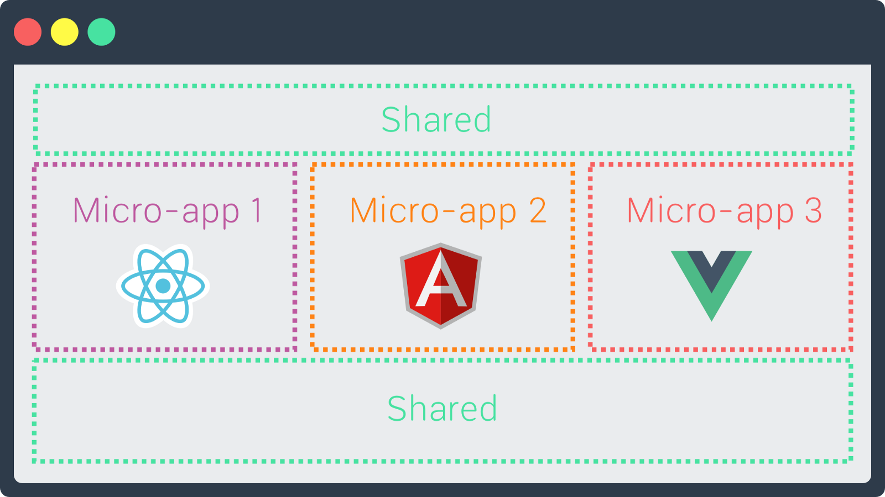

# SOA-FE 前端微服务开发指南
> 基础架构

[](https://travis-ci.org/water-design/fe-microservice-base)
## 简介

&emsp;&emsp;对于网络应用程序,前端越来越大,我们的网络应用程序中90％是前端代码.

&emsp;&emsp;随着时间的推移,Web应用也会发生变化,开发技术和框架也是如此, 这需要支持允许不同的前端框架共存、共用、共生, 前端微服务化应运而生.

## 准备
1. 获取微服务基础工程

    下载github微服务Master分支[基础工程ZIP包](https://github.com/water-design/fe-microservice-base/archive/master.zip),然后初始化git和安装依赖.

  - 依赖
    
    a. angular版本: 6.1
    
    b. 使用[ng-cosmos-ui](https://water-design.github.io/ng-cosmos-ui/)组件库,[water-service](https://github.com/water-design/fe-microservice-base/blob/master/WATER.md)处理后端数据
    
    c. 使用water-utils处理国际化和多主题切换
    
  - 目录说明
  ```bash  
    ├── [说明]  README.md
    ├── [ng配置]  angular.json
    ├── [webpack配置]  config
    ├── [微服务部署]  deploy
    ├── [打包输出]  dist
    ├── [测试]  e2e
    ├── [依赖包]  node_modules
    ├── [依赖锁定]  package-lock.json
    ├── [依赖配置]  package.json
    ├── [代码检查]  sonar-project.properties
    ├── [开发目录]  src
    ├── [测试]  test.json
    ├── [ts配置]  tsconfig.json
    ├── [ts检查]  tslint.json
    └── [webpack基础配置]  webpack.config.js
```
1. 启动工程

```node
//安装依赖
$ npm i

//启动开发服务
$ npm start

```

## 定义微服务

1. 在根Module中定义
需要引入@angular/elements,elements-zone-strategy,示例:

```ts
/**
 * soa-demo
 * https://github.com/water-design/fe-microservice-base
 */
import { BrowserModule } from '@angular/platform-browser';
import { BrowserAnimationsModule } from '@angular/platform-browser/animations';
import { NgModule, Injector } from '@angular/core';
import { FormsModule } from '@angular/forms';
import { createCustomElement } from '@angular/elements';
import { ElementZoneStrategyFactory } from 'elements-zone-strategy';
import { NgZorroAntdModule, NZ_I18N, zh_CN } from 'ng-cosmos-ui';
import { CenterModule } from './center/center.module';
import { AppComponent } from './app.component';

// 配置 angular i18n
import { registerLocaleData } from '@angular/common';
import zh from '@angular/common/locales/zh';
registerLocaleData(zh);

// 配置 water-utils i18n for soa
import { TranslateModule, TranslateLoader, HttpLoaderFactory } from "water-utils";
import { HttpClientModule, HttpClient } from '@angular/common/http';


@NgModule({
  declarations: [AppComponent],
  imports: [
    BrowserModule,
    BrowserAnimationsModule,
    FormsModule,
    CenterModule,
    NgZorroAntdModule,
    HttpClientModule,
    TranslateModule.forRoot({
      loader: {
        provide: TranslateLoader,
        useFactory: HttpLoaderFactory,
        deps: [HttpClient]
      }
    })
  ],
  providers: [{ provide: NZ_I18N, useValue: zh_CN }],
  entryComponents: [AppComponent]
})

export class AppModule {
  //定义微服务
  constructor(private injector: Injector) {
    const strategyFactory = new ElementZoneStrategyFactory(AppComponent, this.injector);
    const customCosmos = createCustomElement(AppComponent, { injector: this.injector, strategyFactory });
    customElements.define('soa-demo', customCosmos);
  }

  ngDoBootstrap() { }
}
```

2. ElementZoneStrategyFactory工厂函数返回一个Angular Component 和 Custom Elements 的桥梁策略类,创建和销毁组件引用,同时它还会在 input 改变时触发脏检查,示例:
```ts
...
const strategyFactory = new ElementZoneStrategyFactory(AppComponent, this.injector);
...
```
3. createCustomElement和customElements.define分别创建和定义一个自定义元素,其中customElements.define第一个参数为最终定义的自定义元素标签名称,示例:
- ts代码
```ts
...
const customCosmos = createCustomElement(AppComponent, { injector: this.injector, strategyFactory });
customElements.define('soa-demo', customCosmos);
...
```
4. 在根组件app.component.ts中定义微服务对外提供的接口,目前对外提供5个接口,2个事件,如下:
> 接口说明

| 名称                | 说明                                                                           | 类型           | 默认值         |
| ------------------- | ------------------------------------------------------------------------------ | -------------- | -------------- |
| **`urlBase`**       | 后台服务基础url                                                                | `string`       |                |
| **`typeTheme`**     | 主题切换方式(enum TYPETHEME { self, fork }; self:自切换,fork:跟随宿主应用切换) | `string`       | 'self'         |
| **`theme`**         | 主题配色(颜色值)                                                               | `string`       | @primary-color |
| **`lang`**          | 语言('zh', 'en')                                                               | `string`       | 'zh'           |
| **`lessUrl`**       | 调试less                                                                       | `string`       |                |
| **`onThemeChange`** | 主题改变时触发                                                                 | `EventEmitter` |                |
| **`onLangChange`**  | 语言改变时触发                                                                 | `EventEmitter` |                |

- html代码
```html
<!doctype html>
<html lang="en">

<head>
  <meta charset="utf-8">
  <title>soa-demo</title>
  <base href="/">
  <meta name="viewport" content="width=device-width, initial-scale=1">
  <link rel="icon" type="image/x-icon" href="favicon.ico">
  <link rel="stylesheet" type="text/css" href="https://jic.talkingdata.com/fa-static-resource/css/ng-cosmos-ui.min.css">
</head>

<body>
  <soa-demo></soa-demo>
</body>

</html>
```


扩展阅读:[可重用网络组件](https://developers.google.com/web/fundamentals/web-components/customelements)   

## 微服务命名规范和注意事项

- 元素定义命名规范,标签以soa-开头,后追加上该微服务英文名称,对应js文件以soa.开头,命名同标签,示例:
```ts
  //js命名
  soa.soaname.js
  //tag定义
  <soa-soaname></soa-soaname>
```
- 微服务中不能使用路由,有需要用到路由的场景需要分拆服务

## 开发规范

- 遵循[angular风格指南](https://angular.cn/guide/styleguide)开发
- Tslint语法规范
- SonarQube规范

## 本地部署和测试
- 修改对应脚本和部署文件
1. 修改package.json中"copy:bundle"项,示例:
```json
"copy:bundle": "cpr dist/soa-elements/main.js deploy/soa/soa.soaname.js -o",
```
2. 修改deploy目录index.html对应的js引用和tag调用,示例:
```html
<html>

<head>
  <meta charset="UTF-8">
  <base href="/">
  <title>soa demo for deploy</title>
  <meta name="viewport" content="width=device-width, initial-scale=1">
  <link rel="icon" type="image/x-icon" href="favicon.ico">
  <link rel="stylesheet" type="text/css" href="https://jic.talkingdata.com/fa-static-resource/css/ng-cosmos-ui.min.css">
  <!-- Gz share dep -->
  <script src="https://jic.talkingdata.com/fa-static-resource/libs/soa.base.js"></script>
  <!-- 这里修改对应js引用 -->
  <!-- Custom Element For SOA -->
  <script src="./soa/soa.demo.js"></script>
</head>

<body>
  <!-- 这里修改对应tag调用 -->
  <!-- Calling SOA -->
  <soa-demo urlBase="http://5990367be1e4470011c46fa8.mockapi.io" typeTheme="self" lessUrl="/assets/less/soa.demo.less"></soa-demo>

  <!-- Invoke -->
  <script>
    let soa = document.querySelector('soa-demo');
    soa.lang = 'en';
    soa.theme = 'blue';
    soa.addEventListener('onThemeChange', (e) => {
      console.log(`主题切换为:${e.detail}`)
    })
    soa.addEventListener('onLangChange', (e) => {
      console.log(`语言切换为:${e.detail}`)
    })
  </script>
</body>

</html>
```

- 执行脚本
```node
//部署微服务
$ npm run deploy

//更新微服务
$ npm run build
```

## 国际化和主题
首先安装water-utils(最新工程已经安装集成)
```ts
$ npm i water-utils
```
### 国际化
1. 在根app.module中引入water-utils包,导入TranslateModule, TranslateLoader, HttpLoaderFactory,同时导入依赖HttpClientModule, HttpClient
```ts
...
import { TranslateModule, TranslateLoader, HttpLoaderFactory } from "water-utils";
import { HttpClientModule, HttpClient } from '@angular/common/http';
...
```
2. 在@NgModule装饰器中,声明模块
```ts
@NgModule({
  imports: [
    ...
    HttpClientModule,
    TranslateModule.forRoot({
      loader: {
        provide: TranslateLoader,
        useFactory: HttpLoaderFactory,
        deps: [HttpClient]
      }
    })
  ]
})
```
3. 新建app.translate.ts文件,配置翻译,目前只配置中文和英文,统一根据微服务命名作为主key(SOANAME),示例:
```ts
/**
 * water-utils 多语言配置
 * zh and en
 * ot
 */
export const en = {
    "SOANAME": {
        "TITLE": "Welcome to microservices",
        "SELECT": "Change language",
        "THEME": "Change theme",
        "LAR": "large",
        "DEF": "default",
        "SML": "small"
    }
}

export const zh = {
    "SOANAME": {
        "TITLE": "欢迎使用微服务",
        "SELECT": "选择语言",
        "THEME": "切换主题",
        "LAR": "大",
        "DEF": "中",
        "SML": "小"
    }
}
```
4. 在根组件app.component.ts中引入TranslateService和翻译配置文件
```ts
import { TranslateService } from 'water-utils';
import { en, zh } from "./config/app.translate";
import { en_US, zh_CN, NzI18nService } from "ng-cosmos-ui";
```
5. 在根组件中注入翻译服务,并初始化配置
```ts
  constructor(public translate: TranslateService, private nzI18nService: NzI18nService ...) {
    //初始化国际化配置
    translate.setTranslation('zh', zh);
    translate.setTranslation('en', en);
    translate.addLangs(['zh', 'en']);
    translate.setDefaultLang('zh');

  }
```
6. 调用翻译服务进行语言切换,示例:
```ts
    this.translate.use(la);
    this.nzI18nService.setLocale(la === "en" ? en_US : zh_CN);
```
### 主题
1.在工程src/assets/less目录下新建soa.name.less主题配置文件,引入基础less配置文件,添加需要切换主题的样式,调用@primary-color变量,示例:
```less
@import url("https://jic.talkingdata.com/fa-static-resource/less/soa.base.less");
//自定义配置
.micro {
    background:@primary-color
  }
...
```

2. 在根组件中引入waterTheme服务和环境变量
```ts
import WaterTheme from 'water-utils';
import { environment } from "../environments/environment";
```
3. 在根组件ngOnInit生命周期中初始化less配置文件,其中lessUrl会根据环境变量引入对应环境的less配置文件,示例:
```ts
...
  lessUrl: string = environment.production ? "https://jic.talkingdata.com/fa-static-resource/less/soa.demo.less" : "/assets/less/soa.demo.less"

  ngOnInit() {
     WaterTheme.initLess(this.lessUrl);
  }
...

```
4. 调用waterTheme服务changeTheme方法切换主题配色
```ts
  WaterTheme.changeTheme(color)
```
## 云端部署
基于前端微服务架构的部署系统
### 系统架构
基于node + koa + mongodb
...

### 前端部署

使用前端微服务部署系统上传、发布、引用微服务


